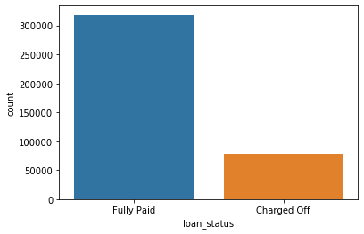
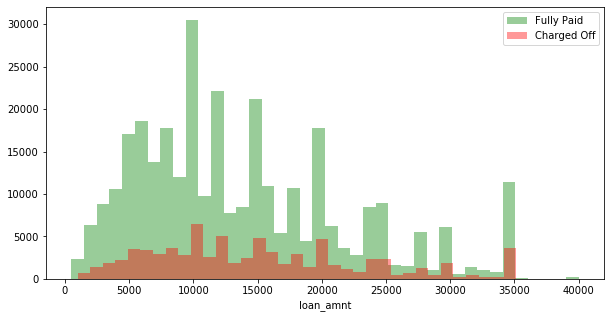
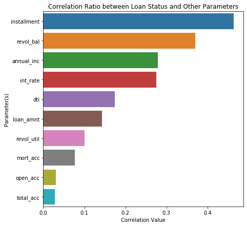
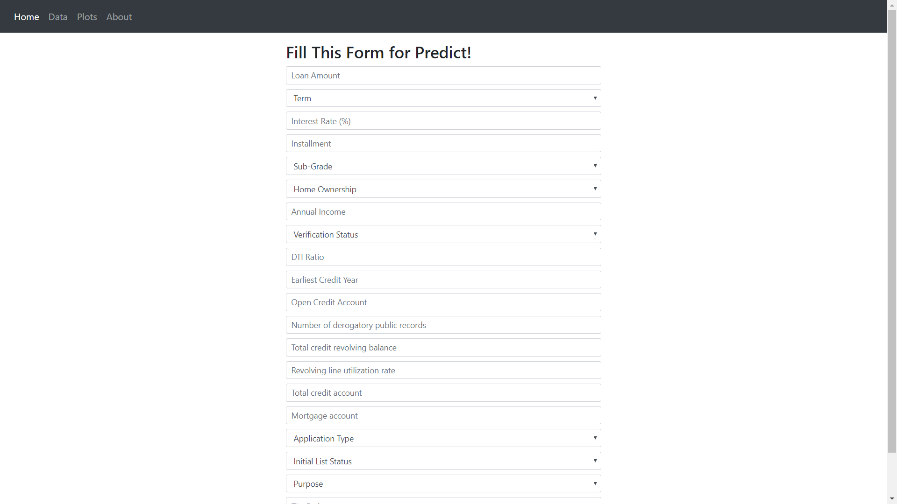
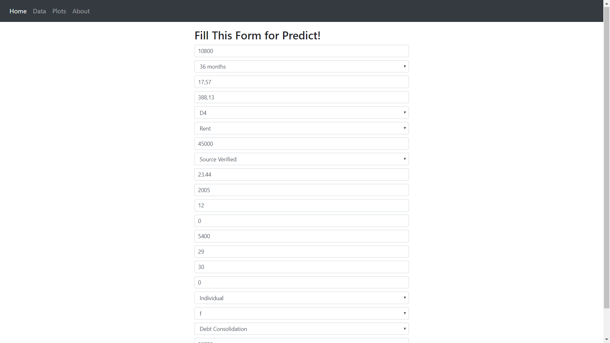
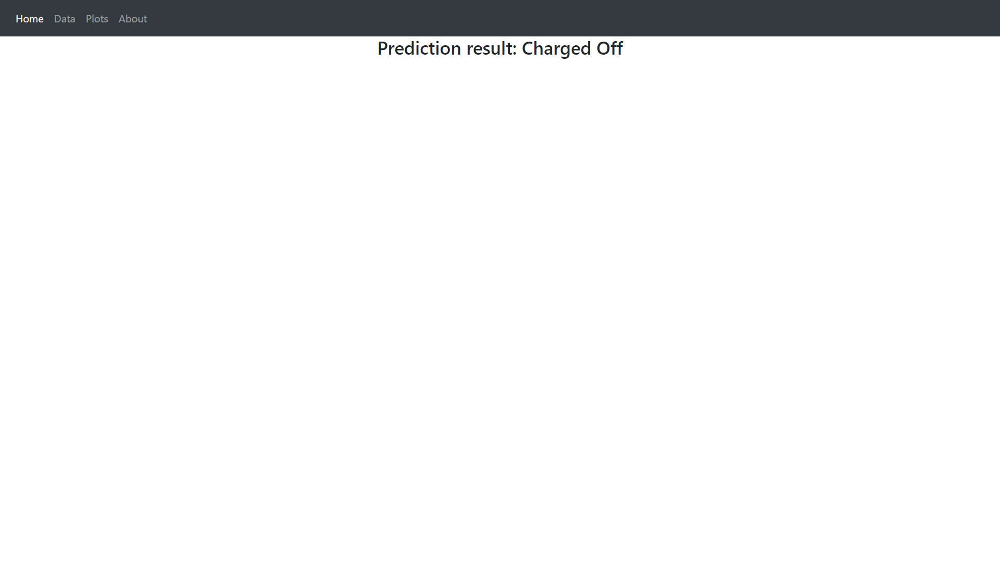

# Final Project (Lending Club Prediction)

LendingClub is the world's largest peer-to-peer lending platform located in San Francisco, California, United States. My goal is to use dataset provided to build a model that predict wether or not the borrower will pay back the loan. The model can help assess new borrowers if they will be able to pay the loan based on their historical information.

# 1. Data Overview

Here are the details of this dataset:

<table border="1" class="dataframe">
  <thead>
    <tr style="text-align: right;">
      <th></th>
      <th>LoanStatNew</th>
      <th>Description</th>
    </tr>
  </thead>
  <tbody>
    <tr>
      <th>0</th>
      <td>loan_amnt</td>
      <td>The listed amount of the loan applied for by the borrower. If at some point in time, the credit department reduces the loan amount, then it will be reflected in this value.</td>
    </tr>
    <tr>
      <th>1</th>
      <td>term</td>
      <td>The number of payments on the loan. Values are in months and can be either 36 or 60.</td>
    </tr>
    <tr>
      <th>2</th>
      <td>int_rate</td>
      <td>Interest Rate on the loan</td>
    </tr>
    <tr>
      <th>3</th>
      <td>installment</td>
      <td>The monthly payment owed by the borrower if the loan originates.</td>
    </tr>
    <tr>
      <th>4</th>
      <td>grade</td>
      <td>LC assigned loan grade</td>
    </tr>
    <tr>
      <th>5</th>
      <td>sub_grade</td>
      <td>LC assigned loan subgrade</td>
    </tr>
    <tr>
      <th>6</th>
      <td>emp_title</td>
      <td>The job title supplied by the Borrower when applying for the loan.*</td>
    </tr>
    <tr>
      <th>7</th>
      <td>emp_length</td>
      <td>Employment length in years. Possible values are between 0 and 10 where 0 means less than one year and 10 means ten or more years.</td>
    </tr>
    <tr>
      <th>8</th>
      <td>home_ownership</td>
      <td>The home ownership status provided by the borrower during registration or obtained from the credit report. Our values are: RENT, OWN, MORTGAGE, OTHER</td>
    </tr>
    <tr>
      <th>9</th>
      <td>annual_inc</td>
      <td>The self-reported annual income provided by the borrower during registration.</td>
    </tr>
    <tr>
      <th>10</th>
      <td>verification_status</td>
      <td>Indicates if income was verified by LC, not verified, or if the income source was verified</td>
    </tr>
    <tr>
      <th>11</th>
      <td>issue_d</td>
      <td>The month which the loan was funded</td>
    </tr>
    <tr>
      <th>12</th>
      <td>loan_status</td>
      <td>Current status of the loan</td>
    </tr>
    <tr>
      <th>13</th>
      <td>purpose</td>
      <td>A category provided by the borrower for the loan request.</td>
    </tr>
    <tr>
      <th>14</th>
      <td>title</td>
      <td>The loan title provided by the borrower</td>
    </tr>
    <tr>
      <th>15</th>
      <td>zip_code</td>
      <td>The first 3 numbers of the zip code provided by the borrower in the loan application.</td>
    </tr>
    <tr>
      <th>16</th>
      <td>addr_state</td>
      <td>The state provided by the borrower in the loan application</td>
    </tr>
    <tr>
      <th>17</th>
      <td>dti</td>
      <td>A ratio calculated using the borrower’s total monthly debt payments on the total debt obligations, excluding mortgage and the requested LC loan, divided by the borrower’s self-reported monthly income.</td>
    </tr>
    <tr>
      <th>18</th>
      <td>earliest_cr_line</td>
      <td>The month the borrower's earliest reported credit line was opened</td>
    </tr>
    <tr>
      <th>19</th>
      <td>open_acc</td>
      <td>The number of open credit lines in the borrower's credit file.</td>
    </tr>
    <tr>
      <th>20</th>
      <td>pub_rec</td>
      <td>Number of derogatory public records</td>
    </tr>
    <tr>
      <th>21</th>
      <td>revol_bal</td>
      <td>Total credit revolving balance</td>
    </tr>
    <tr>
      <th>22</th>
      <td>revol_util</td>
      <td>Revolving line utilization rate, or the amount of credit the borrower is using relative to all available revolving credit.</td>
    </tr>
    <tr>
      <th>23</th>
      <td>total_acc</td>
      <td>The total number of credit lines currently in the borrower's credit file</td>
    </tr>
    <tr>
      <th>24</th>
      <td>initial_list_status</td>
      <td>The initial listing status of the loan. Possible values are – W, F</td>
    </tr>
    <tr>
      <th>25</th>
      <td>application_type</td>
      <td>Indicates whether the loan is an individual application or a joint application with two co-borrowers</td>
    </tr>
    <tr>
      <th>26</th>
      <td>mort_acc</td>
      <td>Number of mortgage accounts.</td>
    </tr>
    <tr>
      <th>27</th>
      <td>pub_rec_bankruptcies</td>
      <td>Number of public record bankruptcies</td>
    </tr>
  </tbody>
</table>

## 2. Exploratory
I used several plots to describe the features of this dataset. Here are few figures that I have plotted.




## 3. Data Pre-processing
For data pre-processing, I analyzed and handled the missing values of each features and creating dummy variables from categorical features using one hot encoding.

## 4. Modelling, Prediction, and Evaluation
I tried to use several methods to model the loan status, and then use the best method and tune the hyperparameters. Below are the results of precision, recall and accuracy of the base models.
| Method | Train Recall | Train Precision | Train Accuracy | Test Recall | Test Precision | Test Accuracy |
| --- | --- | --- | --- | --- | --- | --- |
| Logistic Regression | 0.593543 | 0.623913 | 0.617882 | 0.579193 | 0.285341 | 0.629282 |
| Gradient Boosting Classifier | 0.864555 | 0.911097 | 0.890097 | 0.510410 | 0.606373 | 0.837382 |
| Gaussian Naive Bayes | 0.598168 | 0.660558 | 0.645393 | 0.558245 | 0.308684 | 0.664832 |
| XGBClassifier | 0.875011 | 0.982945 | 0.929914 | 0.486397 | 0.866834 | 0.883457 |
| Decision Tree Classifier | 1.000000 | 1.000000 | 1.000000 | 0.594457 | 0.541667 | 0.820024 |
| RandomForestClassifier | 0.999988 | 1.000000 | 0.999994 | 0.476562 | 0.865862 | 0.881686 |

Based on results above, I chose XGBoost Classifier and Decision Tree to tune the hyperparameters.

## 5. Hyperparameters Tuning
### a. XGBClassifier
Below are the hyperparameters of XGBoost Classifier that I have tuned.
```
'max_depth':[8,9,10],
'min_child_weight':[2,3,4]
'gamma': [0.0, 0.1, 0.2, 0.3, 0.4]
'colsample_bytree': [0.6, 0.7, 0.8, 0.9]
'subsample': [0.6, 0.7, 0.8, 0.9]
'reg_alpha': [1e-05, 0.01, 0.1, 1, 100]
```

From the hyperparameter tuning, below are the results of classification report.
| Model | Precision | Recall | Accuracy |
| --- | --- | --- | --- |
| XGBClassifier | 0.88 | 0.49 | 0.89 |

### b. Decision Tree Classifier
Below are the hyperparameters of Decision Tree Classifier that I have tuned.
```
'max_depth': np.linspace(1, 32, 32, endpoint=True)
'min_samples_split': np.linspace(0.001, 0.01, 10, endpoint=True)
'min_samples_leaf': np.linspace(0.0001, 0.001, 10, endpoint=True)
'max_features': list(range(1,X_train.shape[1]))
```
From the hyperparameter tuning, below are the results of classification report.
| Model | Precision | Recall | Accuracy |
| --- | --- | --- | --- |
| Decision Tree Classifier | 0.32 | 0.91 | 0.60 |

## 6. Deployment
The decision tree classifier model that has been fitted are deployed to the dashboard to predict the loan status in the feature. The dashboard is displayed below.



As we can see, our model managed to predict loan status correctly.

## 7. Conclusion
Based on the analysis, we can conclude that decision tree classifier is able to predict loan status with 91% recall score. For further analysis, we may need to analyze the ROC-AUC to increase the recall and accuracy score.
